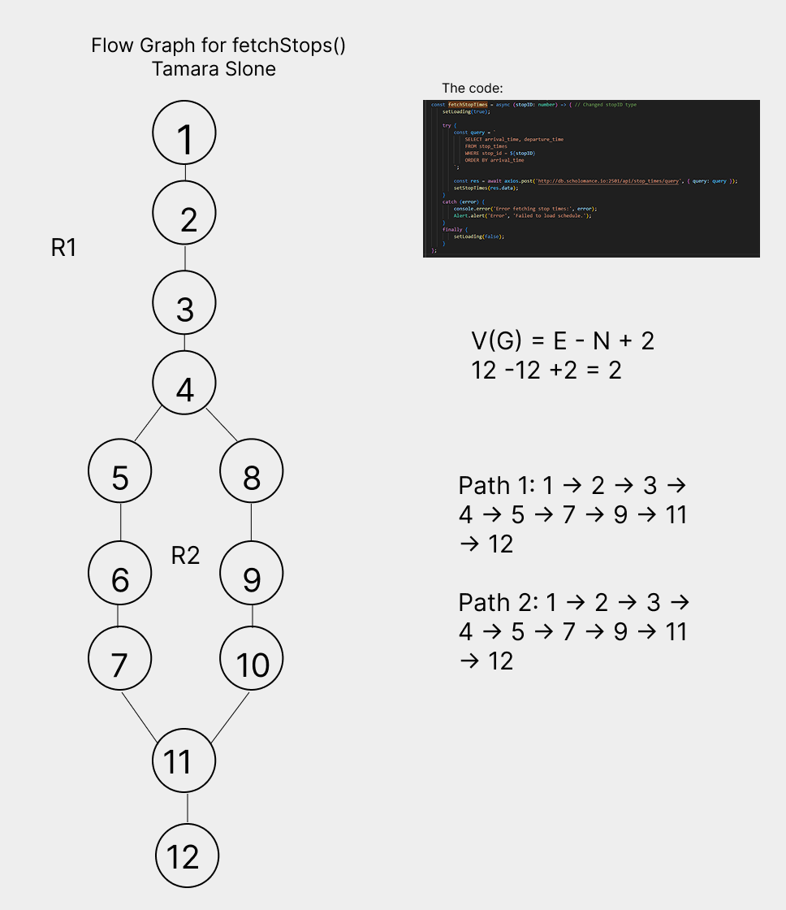
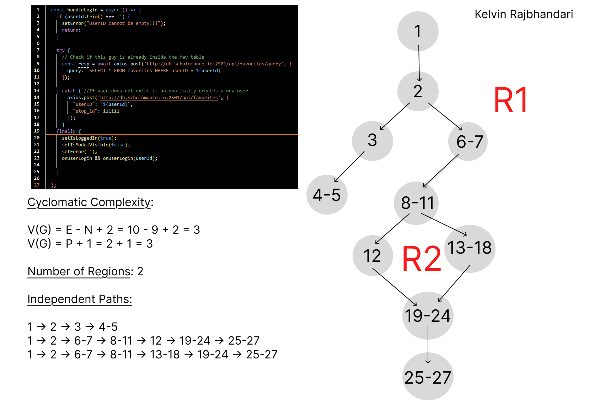

# Work Attribution

### Tamara:

- Created SQL Tables and converted data from King County metro into database infrastructure
- Implemented the Main menu bar (Bottom bar with symbols)
- Implemented the Map Screen (index.tsx) and functions, Map Markers(BusMarker.tsx) Component, and Bus Schdueling Component (BusSchduele.tsx)

Flow-Graph:

### Kelvin:

- Created the Menu Component.
- Created the UserProfile Component.
- Implemented login/logout functionality.
- Implemented the OneBusAway API ❌ (scrapped b/c API key problems)
- Implemented the TransitLand APi ❌ (scrapped b/c wouldn't filter anything)

Flow-Graph:

### Ken:

- Designed and implemented the global theme system with dark mode, dynamic font styles, and custom font color settings
- Refactored UI to use global theme context (ThemeContext) across all screens
- Implemented the Settings screen modal for user customization (theme, font, font color)
- Integrated font and theme switching into all major screens (FavoritesList, AddFavorite, Map screen)

### Joe:

- Developed database infrastructure
- Designed and implemented CRUD API
- Implemented the FavoritesList component
- Implemented the AddFavorite component
